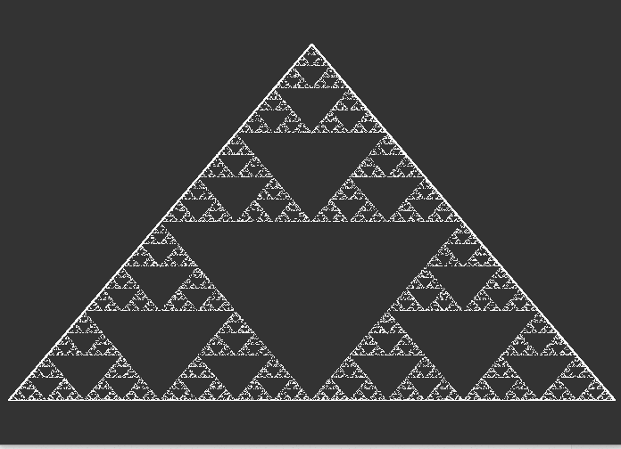

# Fractals.py
In this repository you will find examples of fractals written  in [processing.py](https://processing.org/). Processing is a flexible software sketchbook and a language for learning how to code within the context of the visual arts, you write processing code in python.  

Here you can find the [documentation](https://py.processing.org/) of the Processing-language.  

## What is a Fractal? 
---
 

